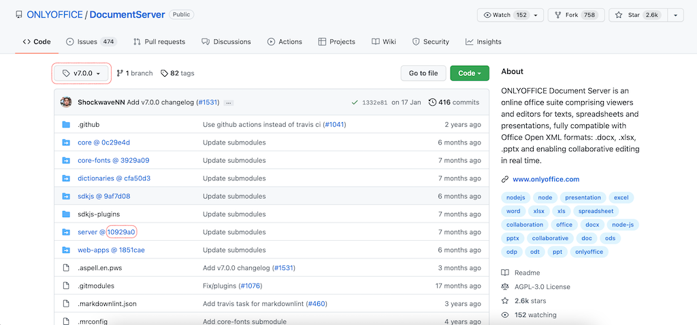

# About
This project contains scripts and instructions for building and installing [server](https://github.com/ONLYOFFICE/server) component 
of ONLYOFFICE [DocumentServer](https://github.com/ONLYOFFICE/DocumentServer) with required parameters (such as number of allowed connections) and [web-apps](https://github.com/ONLYOFFICE/web-apps) editors with unlocked mobile editing.

# Prerequisite
ONLYOFFICE Server is installed and running.

# Build and install
1. Navigate to [DocumentServer](https://github.com/ONLYOFFICE/DocumentServer) and select tag, corresponding to a version you are using.
2. Copy abbreviated commit hash for `sdkjs`, `web-apps` and `server` submodules. 
3. In the root directory of this project run `docker build -t docservice-builder .` to build docker image needed for later steps.
4. Run docker container based on image built on the previous step providing `HASH_SDKJS`, `HASH_WEB_APPS`, `HASH_SERVER`, `BUILD_VERSION`, `BUILD_NUMBER` and `CONNECTIONS` env variables, as well as mounting `/out` volume to host directory of your choice &ndash; `docservice` file and `app.js` files for editors will appear there after docker container completes. `BUILD_VERSION` and `BUILD_NUMBER` should be the same as build version and build number of `DocumentServer` you are running. For example:
```
$ docker run --rm --memory 8g \
-e HASH_SDKJS=0ab8241 \
-e HASH_WEB_APPS=264a216 \
-e HASH_SERVER=bce1a81 \
-e BUILD_VERSION=7.3.2 \
-e BUILD_NUMBER=8 \
-e CONNECTIONS=9999 \
-v $(pwd)/out:/out \
docservice-builder
```
6. Stop ONLYOFFICE `DocumentServer` and backup it up.
 
7. Locate `docservice` file (usually it can be found at `/var/www/onlyoffice/documentserver/server/DocService` directory) and replace with newly built file from `/out`.

8. Locate and replace with newly built `app.js` files in respective directories:
 - `/var/www/onlyoffice/documentserver/web-apps/apps/documenteditor/mobile/dist/js`,
 - `/var/www/onlyoffice/documentserver/web-apps/apps/spreadsheeteditor/mobile/dist/js`,
 - `/var/www/onlyoffice/documentserver/web-apps/apps/presentationeditor/mobile/dist/js`.

9. Start ONLYOFFICE `DocumentServer` and check that everything works as expected.

