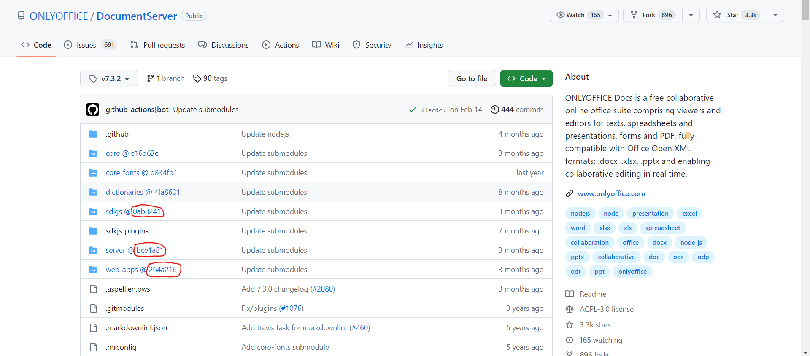

# About
This project contains scripts and instructions for building and installing [server](https://github.com/ONLYOFFICE/server) component 
of ONLYOFFICE [DocumentServer](https://github.com/ONLYOFFICE/DocumentServer) with required parameters (such as number of allowed connections).

# Prerequisite
ONLYOFFICE Server is installed and running.

# Build and install
1. Navigate to [DocumentServer](https://github.com/ONLYOFFICE/DocumentServer) and select tag, corresponding to a version you are using.
2. Copy abbreviated commit hash for `server` submodule. 
3. In the root directory of this project run `docker build -t docservice-builder .` to build docker image needed for later steps.
4. Run docker container base on image built on the previous step providing `HASH`, `BUILD_VERSION`, `BUILD_NUMBER` and `CONNECTIONS`
 env variables, as well as mounting `/out` volume to host directory of your choice &ndash; file `docservice` will appear here after docker container completes.
 `BUILD_VERSION` and `BUILD_NUMBER` should be the same as build version and build number of `DocumentServer` you are running. For example:
```
$ docker run --rm \
-e HASH=10929a0 \
-e BUILD_VERSION=7.0.0 \
-e BUILD_NUMBER=132 \
-e CONNECTIONS=9999 \
-v $(pwd)/out:/out \
docservice-builder
```
6. Stop ONLYOFFICE `DocumentServer`, locate `docservice` file (usually it can be found at `/var/www/onlyoffice/documentserver/server/DocService` directory)
 backup it and then replace with newly built file from `/out`.
7. Start ONLYOFFICE `DocumentServer` and check that everything works as expected.

